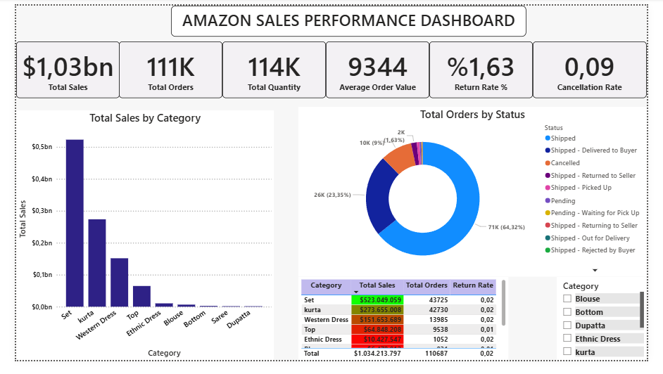
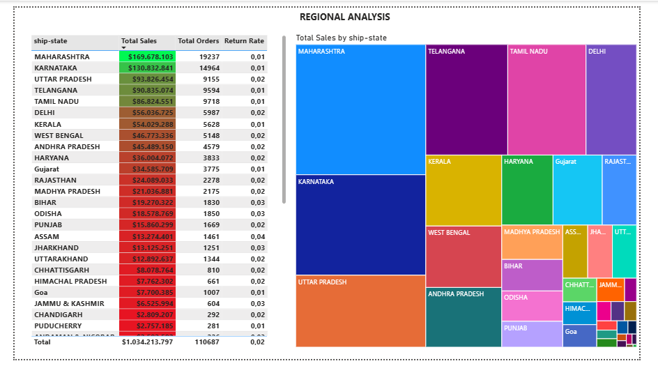

# Amazon Sales Dashboard (Business Analyst Case Study)

## 📌 Project Overview
This project simulates a **Business Analyst role** by turning raw e-commerce sales data into insights.  
The main goal was to clean and prepare Amazon sales data, design KPIs, and create a professional dashboard for sales managers.

---

## 🛠️ Business Problem & Solution
**Problem:**  
Sales data was scattered and managers couldn’t easily track product performance, returns, or overall sales.  
This led to **delayed decision-making** and poor visibility of sales health.

**Solution:**  
- Data cleaning with **Power Query**  
- KPI design (Total Sales, Orders, Quantity, AOV, Return Rate, Cancellation Rate)  
- Dashboard in **Power BI** to track category sales, order status, and regional sales  

---

## 📊 Dashboard Features
- KPI Cards: Total Sales, Total Orders, Quantity, Average Order Value, Return Rate, Cancellation Rate  
- Sales by Category (Column Chart)  
- Orders by Status (Donut Chart)  
- Category-wise performance (Table + Slicer)  
- Regional Sales (Treemap + Table)

📷 **Dashboard Screenshot**  

---

## 📂 Documentation
- [Case Study](./docs/case_study.md)  
- [Sprint Plan](./docs/sprint_plan.md)  
- [Acceptance Criteria](./docs/acceptance_criteria.md)

---

## 🚀 Tools Used
- Power Query  
- Power BI  
- Agile Framework (User Stories, Acceptance Criteria, Sprint Planning)

---

## 🎯 Outcome
Managers can now track sales performance at a glance, identify best-selling categories, monitor returns, and evaluate regional sales.  
This supports **faster, data-driven business decisions**.
